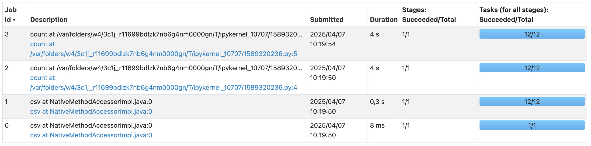
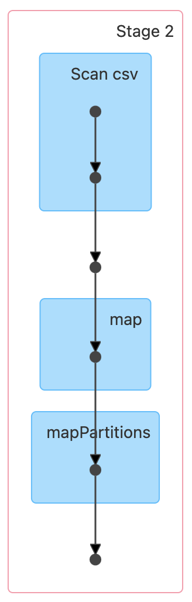
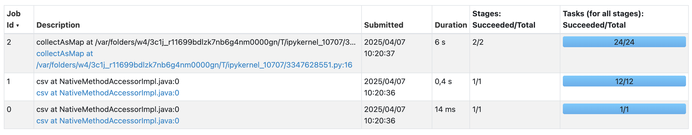
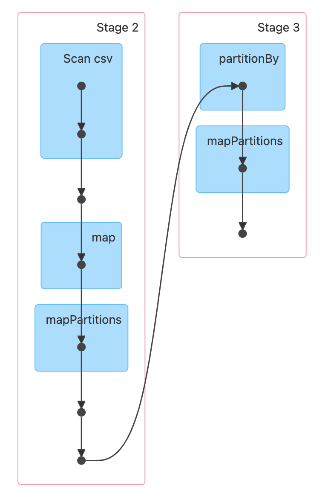
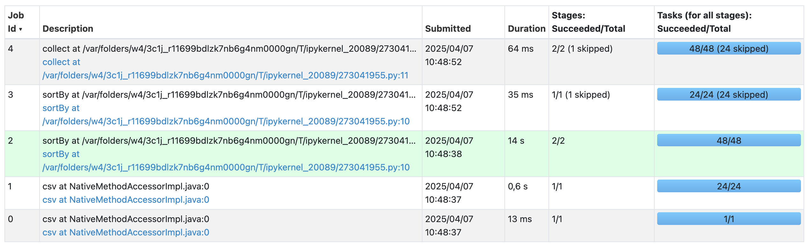
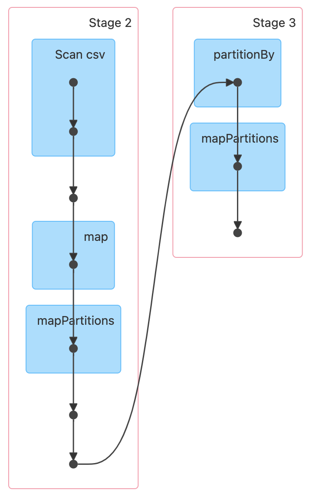

# TP3: Spark et Parquet


### Antoine Cheneau, Elie Caratgé

## Configuration initiale


```python
import re
from pyspark.sql import SparkSession
from pyspark.rdd import PipelinedRDD
import os

regex = re.compile("[^a-zA-Z ]")


def remove_non_letters(word):
    return regex.sub("", word)


def get_spark_session_and_words_rdd() -> tuple[SparkSession, PipelinedRDD]:
    # Réinitialisation de la session Spark
    spark = SparkSession.builder.getOrCreate()
    spark.stop()
    spark = SparkSession.builder.getOrCreate()

    # Lecture du fichier books.csv et prétraitement
    books_rdd: PipelinedRDD = spark.read.csv(
        "books.csv", header=True, inferSchema=True, sep=";"
    ).rdd
    books_rdd = books_rdd.map(lambda row: remove_non_letters(row[1]))
    books_rdd = books_rdd.flatMap(lambda line: line.split(" "))
    books_rdd = books_rdd.filter(lambda word: len(word) > 0)
    return spark, books_rdd


# Print taille du fichier csv en MB
file_size = os.path.getsize("books.csv") / (1024 * 1024)
print(f"books.csv size: {file_size:.2f} MB")
```

    books.csv size: 787.65 MB


## Exercice 1 : Interface Spark UI

Après avoir lancé Spark, nous pouvons accéder à l'interface Spark UI à l'adresse http://localhost:4040.

Dans l'interface Spark UI standard, on trouve normalement les onglets suivants :
- Jobs
- Stages
- Storage
- Environment
- Executors
- SQL / DataFrame

Cependant, dans notre configuration locale, certains onglets ne sont pas disponibles car ils dépendent des fonctionnalités que nous utilisons. Les onglets qui manquent sont :
- Structured Streaming
- Streaming (DStreams)
- JDBC/ODBC Server

## Exercice 2 : Analyse des exécuteurs

Dans l'onglet "Executors" du Spark UI, on peut voir le nombre de coeurs utilisés par chaque exécuteur. Il y a un unique exécuteur local qui utilise tous les coeurs disponibles, c'est-à-dire 12 coeurs. Cet exécuteur pourra lancer jusqu'à 12 tâches en parallèle.

Pour utiliser cette information pour mieux configurer et exécuter notre application Spark :

1. **Parallélisme optimal** : Nous pouvons ajuster le niveau de parallélisme de notre application en fonction du nombre de coeurs disponibles. Par exemple, si nous avons 12 coeurs, nous pourrions configurer `spark.default.parallelism` à un multiple de 12 (comme 24 ou 36) pour maximiser l'utilisation des ressources.

2. **Partition des données** : Nous pouvons également ajuster le nombre de partitions de nos RDD en fonction du nombre de cœurs. Une bonne pratique est d'avoir 2-3 partitions par coeur disponible.


## Exercice 3 : Algorithme naïf pour compter les mots de longueur paire/impaire

Implémentons un algorithme "naïf" pour compter combien de mots ont un nombre pair ou impair de caractères dans le fichier books.csv.


```python
spark, words_rdd = get_spark_session_and_words_rdd()

# Algorithme naïf : utilise deux actions de comptage distinctes
odd_words = words_rdd.filter(lambda word: len(word) % 2 != 0).count()
even_words = words_rdd.filter(lambda word: len(word) % 2 == 0).count()

print(f"Even length words: {even_words}")
print(f"Odd length words: {odd_words}")
```

    Even length words: 58705920
    Odd length words: 72253440


### Liste des jobs



### Détails d'un job "count"


### Analyse du DAG et de l'accès aux données

Dans l'algorithme naïf ci-dessus, deux opérations d'action distinctes (`count`) sont exécutées sur des RDD filtrés.

**Analyse du DAG:**
- Le DAG montre deux jobs distincts, un pour chaque opération `count`
- Le fichier csv est décomposé en 12 partitions, permettant un traitement parallèle


**Accès aux données:**
- Chacun des jobs lit le fichier csv en entier, ce qui entraîne une double lecture des données
- Le processus complet de traitement est répété pour chaque job

Cette implémentation n'est pas optimale car elle entraîne une double lecture des données et un traitement redondant.

## Exercice 4 : Algorithme MapReduce pour compter les mots de longueur paire/impaire

Implémentons maintenant un algorithme de type MapReduce pour effectuer le même comptage, mais de manière plus efficace.


```python
def word_length_mapper(word):
    return (len(word) % 2, 1)


def word_length_reducer(a, b):
    return a + b


spark, books_rdd = get_spark_session_and_words_rdd()

# Perform MapReduce
word_length_counts = (
    books_rdd.map(word_length_mapper).reduceByKey(word_length_reducer)
).collectAsMap()

# Affichage des résultats
print("Even length words:", word_length_counts.get(0, 0))
print("Odd length words:", word_length_counts.get(1, 0))
```

    Even length words: 58705920
    Odd length words: 72253440


### Liste des jobs


### Détails du job de calcul


### Analyse du DAG et de l'accès aux données

Dans cette implémentation MapReduce, nous utilisons une approche plus efficace avec un seul job Spark.

**Analyse du DAG:**
- Le DAG montre deux stages comprenant les étapes suivantes :
  1. Lecture et transformation des données en tuples avec comme clé 0 ou 1 pour pair ou impair.
  2. Un second stage causé par l'opération `reduceByKey`, qui regroupe les données par clé (0 pour pair, 1 pour impair) et effectue le comptage.

**Accès aux données:**
- Les données sont lues **une seule fois** depuis le fichier source
- Un seul parcours des données de csv est nécessaire pour obtenir à la fois le nombre de mots de longueur paire et impaire
- L'algorithme effectue une opération de shuffle qui envoie les données aux bons réducteurs selon leur clé (0 pour pair, 1 pour impair)
- Cette approche est beaucoup plus efficace pour les grands ensembles de données, car l'accès disque est minimisé

Cette implémentation MapReduce est plus efficace car elle ne nécessite qu'un seul parcours des données, ce qui réduit considérablement le temps d'exécution et les ressources utilisées, en particulier pour les jeux de données volumineux.

## Exercice 5 : Comparaison des deux approches

Comparons maintenant les deux approches en termes d'accès aux données:

**Approche naïve (Exercice 3):**
- Nécessite deux jobs Spark distincts
- Les données sont lues et traitées deux fois
- Chaque job effectue un filtrage différent (pair ou impair)
- Plus d'opérations de lecture et plus de calculs redondants

**Approche MapReduce (Exercice 4):**
- Un seul job Spark de calcul
- Les données sont lues et transformées une seule fois
- La classification des mots (pair/impair) se fait en une seule passe


Pour améliorer davantage les performances, nous pourrions ajuster les paramètres de configuration Spark, comme :
- `spark.default.parallelism` : Niveau de parallélisme par défaut
- `spark.sql.shuffle.partitions` : Nombre de partitions pour les opérations de shuffle
- `spark.executor.memory` : Mémoire allouée à chaque exécuteur
- `spark.driver.memory` : Mémoire allouée au pilote
- `spark.memory.fraction` : Fraction de mémoire utilisée pour l'exécution et le stockage

## Exercice 6 : Optimisation de la configuration Spark

En analysant l'onglet Executors et Environment du Spark UI, on observe qu'un exécuteur utilisant les 12 coeurs de la machine est présent. Chaque partition sera traitée par cet unique exécuteur, avec un maximum de 12 tâches en parallèle. Afin de pouvoir traiter plus de partitions en parallèle, nous pouvons essayer d'utiliser 4 exécuteurs avec 3 coeurs chacun et observer l'impact sur les performances.

## Exercice 7 : Comptage de l'occurrence des mots


```python
spark, words_rdd = get_spark_session_and_words_rdd()

# Transformation des mots en minuscules pour avoir un comptage cohérent
words_rdd = words_rdd.map(lambda word: word.lower())

# Compter les occurrences de chaque mot
word_counts = (
    words_rdd.map(lambda word: (word, 1))
    .reduceByKey(lambda a, b: a + b)
    .sortBy(lambda x: x[1], ascending=False)
    .collect()
)

# Afficher les 10 premiers résultats
print("Top 10 word counts:")
for word, count in word_counts[:10]:
    print(f"{word}: {count}")
```

    Top 10 word counts:
    the: 9031680
    and: 5644800
    of: 5143040
    a: 3637760
    i: 2383360
    to: 2257920
    was: 2132480
    in: 2132480
    that: 2007040
    by: 1505280


### Liste des jobs


### Détails du job de calcul


### Analyse du DAG et de l'interface UI

En examinant le DAG pour cette opération, nous pouvons dire que celui ci est similaire à celui de l'exercice 4 avec un shuffle de données causé par le `reduceByKey`. Un job de type `sortBy` a été ajouté pour trier les mots par ordre alphabétique avant de les collecter.


## Exercice 8 : Recherche du mot le plus utilisé

### Partie 1 : Utilisation de la fonction de tri de Spark


```python
spark, words_rdd = get_spark_session_and_words_rdd()
words_rdd = words_rdd.map(lambda word: word.lower())

# Méthode 1: Utilisation de la fonction de tri intégrée de Spark
word_counts = (
    words_rdd.map(lambda word: (word, 1))
    .reduceByKey(lambda a, b: a + b)
    .sortBy(lambda x: x[1], ascending=False)
)

# Récupérer le mot le plus fréquent
most_common_word = word_counts.first()
print(
    f"Le mot le plus utilisé (méthode Spark) est '{most_common_word[0]}' avec {most_common_word[1]} occurrences"
)
```

    Le mot le plus utilisé (méthode Spark) est 'the' avec 9031680 occurrences


### Partie 2 : Implémentation d'une fonction de tri personnalisée


```python
from operator import add
import random


def quick_sort(data):
    """
    Implémentation du QuickSort pour trier une liste de tuples (mot, fréquence)
    par ordre décroissant de fréquence
    """
    if len(data) <= 1:
        return data

    pivot = data[random.randint(0, len(data) - 1)]
    pivot_value = pivot[1]

    greater = [x for x in data if x[1] > pivot_value]
    equal = [x for x in data if x[1] == pivot_value]
    lesser = [x for x in data if x[1] < pivot_value]

    return quick_sort(greater) + equal + quick_sort(lesser)


def sort_partition(iterator):
    """
    Trie les éléments d'une partition en utilisant QuickSort
    """
    partition_data = list(iterator)
    if not partition_data:
        return []

    return quick_sort(partition_data)


# Code principal
spark, words_rdd = get_spark_session_and_words_rdd()
words_rdd = words_rdd.map(lambda word: word.lower())


# Implémentation manuelle avec QuickSort
word_counts_manual = (
    words_rdd.map(lambda word: (word, 1))
    .reduceByKey(add)  # Utiliser add de operator est plus efficace
    .coalesce(1)  # Rassembler toutes les données sur une seule partition
    .mapPartitions(sort_partition)  # Appliquer QuickSort sur la partition
)

most_common_word_manual = word_counts_manual.first()
print(
    f"Le mot le plus utilisé (méthode personnalisée) est '{most_common_word_manual[0]}' avec {most_common_word_manual[1]} occurrences"
)

```

    Le mot le plus utilisé (méthode personnalisée) est 'the' avec 9031680 occurrences


### Analyse comparative des deux approches

On observe que les deux approches sont similaires en termes de structure de DAG et d'accès aux données, mais il y a quelques différences notables :
   - La première approche permet de calculer le résultat en 8s vs 12s pour la seconde approche.
   - La seconde étape rajoute un stage "coalesce" qui n'est pas nécessaire dans la première approche.
   - Rajouter l'opération coalesce empêche la parallélisation de l'opération de tri, ce qui entraîne une baisse de performance.

## Exercice 9

Lorsqu'on considère le stockage de documents homogènes dans un environnement distribué, le format Parquet offre des avantages significatifs pour l'accès aux champs spécifiques :

1. **Organisation columnaire :** Parquet stocke les données par colonnes plutôt que par lignes. Cette structure permet d'accéder directement aux champs spécifiques sans avoir à lire l'ensemble du document, réduisant considérablement la quantité de données à traiter et à transférer sur le réseau.

2. **Compression :** Parquet compresse chaque colonne indépendamment avec des algorithmes adaptés à son type de données. Les valeurs similaires regroupées ensemble se compressent mieux, ce qui réduit l'espace de stockage et accélère les transferts de données lors de l'accès aux champs spécifiques.

3. **Statistiques :** Parquet stocke des statistiques (min/max, comptages) pour chaque bloc de données. Ces métadonnées permettent d'implémenter des techniques d'optimisation comme le "predicate pushdown", qui élimine les blocs non pertinents avant même de les lire, accélérant considérablement les opérations de filtrage sur des champs particuliers.

## Exercice 10


```python
from pyspark.sql import SparkSession
from pyspark.sql.functions import col, count, explode, split, trim

spark = SparkSession.builder.getOrCreate()
df_parquet = spark.read.parquet("restaurants.parquet")

# Parquet
country_count_spark = df_parquet.groupBy("country").count().orderBy(col("count").desc())
print("Résultat avec Spark :")
country_count_spark.show(1)

# Pandas
country_count_pandas = country_count_spark.toPandas()
print("Résultat avec Pandas :")
print(country_count_pandas.head(1))
```

    Résultat avec Spark :
    +----------+------+
    |   country| count|
    +----------+------+
    | ""Italy""|224761|
    +----------+------+
    only showing top 1 row
    
    Résultat avec Pandas :
          country   count
    0   ""Italy""  224761


# Exercice 11


```python
cuisine_df = df_parquet.select(explode(split(col("cuisines"), ",")).alias("cuisine"))
cuisine_df = cuisine_df.select(trim(col("cuisine")).alias("cuisine"))
cuisine_df = cuisine_df.filter(col("cuisine") != "")
cuisine_count_spark = cuisine_df.groupBy("cuisine").count().orderBy(col("count").desc())

print("Résultat avec Spark :")
cuisine_count_spark.show(1)

```

    Résultat avec Spark :
    +---------+------+
    |  cuisine| count|
    +---------+------+
    |Mid-range|322000|
    +---------+------+
    only showing top 1 row
    

